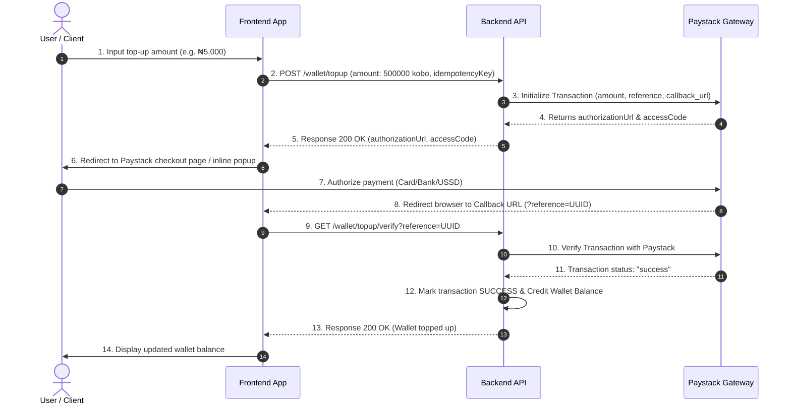
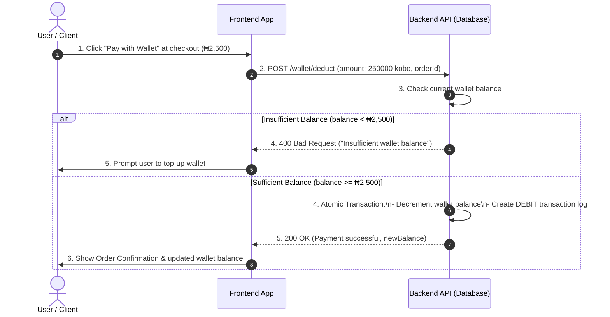

# Wallet & Paystack Integration Guide

A complete technical reference for integrating and interacting with the Wallet endpoints, request payloads, response bodies, field definitions, and end-to-end payment workflows.

---

## 1. Wallet Endpoints Reference

### 1.1 Get Wallet Balance
- **Endpoint**: `GET /wallet`
- **Authentication**: Required (`Bearer <JWT>`)
- **Roles**: `USER`, `ADMIN`, `SUPER_ADMIN`
- **Description**: Retrieves the current balance and currency of the authenticated user's wallet. Automatically creates a wallet initialized with `0.00` NGN balance if one does not exist yet.

#### Request Payload
*None (Headers only: `Authorization: Bearer <token>`)*

#### Response Body (200 OK)
```json
{
  "balance": 5000.00,
  "currency": "NGN",
  "updatedAt": "2026-05-01T10:00:00.000Z"
}
```

#### Field / Term Explanations:
- `balance`: `number` — Current spendable funds in Naira (`NGN`).
- `currency`: `string` — ISO 4217 code (`"NGN"`).
- `updatedAt`: `string (ISO 8601)` — Timestamp when the wallet balance was last updated.

---

### 1.2 Initiate Wallet Top-Up
- **Endpoint**: `POST /wallet/topup`
- **Authentication**: Required (`Bearer <JWT>`)
- **Roles**: `USER`, `ADMIN`, `SUPER_ADMIN`
- **Description**: Initiates a payment session with Paystack. Returns a Paystack payment authorization URL and access code for the client application.

#### Request Payload (`TopUpWalletDto`)
```json
{
  "amount": 500000,
  "provider": "PAYSTACK",
  "idempotencyKey": "9b1deb4d-3b7d-4bad-9bdd-2b0d7b3dcb6d"
}
```

#### Field / Term Explanations (Request):
- `amount`: `number` — Top-up amount in **kobo** (the lowest currency sub-unit). Minimum value is `10000` (which equals `100 NGN`). *Calculation: Amount in Kobo = Amount in NGN × 100*.
- `provider`: `enum ("PAYSTACK")` — Payment gateway service provider.
- `idempotencyKey`: `string` — Unique identifier generated by the frontend for this operation. Prevents double-charging if duplicate requests are sent.

#### Response Body (200 OK)
```json
{
  "message": "Top-up initiated successfully",
  "reference": "9b1deb4d-3b7d-4bad-9bdd-2b0d7b3dcb6d",
  "amount": 500000,
  "currency": "NGN",
  "authorizationUrl": "https://checkout.paystack.com/39a6jkl190b-checkout-ref",
  "accessCode": "39a6jkl190b"
}
```

#### Field / Term Explanations (Response):
- `message`: `string` — Status message.
- `reference`: `string` — The unique transaction reference tracking this top-up operation.
- `amount`: `number` — Top-up amount in kobo as submitted.
- `currency`: `string` — Transaction currency (`"NGN"`).
- `authorizationUrl`: `string` — Hosted checkout page URL where the customer is redirected to pay.
- `accessCode`: `string` — Access token used if rendering the Paystack Inline popup SDK on the frontend.

---

### 1.3 Verify Top-Up
- **Endpoint**: `GET /wallet/topup/verify`
- **Authentication**: Public (no JWT required)
- **Query Parameter**: `reference` (e.g., `?reference=9b1deb4d-3b7d-4bad-9bdd-2b0d7b3dcb6d`)
- **Description**: Verifies payment completion with Paystack when the user returns from the payment page. Automatically updates the wallet transaction status and increments the wallet balance upon success.

#### Request Parameters
- `reference` (Query Param): `string` — The idempotency key / transaction reference created during top-up initiation.

#### Response Body (200 OK)
```json
{
  "message": "Wallet topped up successfully",
  "reference": "9b1deb4d-3b7d-4bad-9bdd-2b0d7b3dcb6d",
  "amount": 5000,
  "currency": "NGN"
}
```

#### Field / Term Explanations:
- `message`: `string` — Confirmation message (e.g., `"Wallet topped up successfully"` or `"Already verified"`).
- `reference`: `string` — The verified transaction reference.
- `amount`: `number` — Net amount credited to the wallet in Naira (`NGN`).
- `currency`: `string` — Currency code (`"NGN"`).

---

### 1.4 Deduct Wallet (Checkout Payment)
- **Endpoint**: `POST /wallet/deduct`
- **Authentication**: Required (`Bearer <JWT>`)
- **Roles**: `USER`, `ADMIN`, `SUPER_ADMIN`
- **Description**: Atomically deducts funds from the user's wallet to pay for an order checkout. Returns a 400 error if the wallet balance is insufficient.

#### Request Payload (`DeductWalletDto`)
```json
{
  "amount": 250000,
  "orderId": "e305e913-93d3-469b-9c76-d18cf41f6492",
  "description": "Payment for order #e305e913"
}
```

#### Field / Term Explanations (Request):
- `amount`: `number` — Deduction amount in **kobo** (e.g., `250000` kobo = `2500 NGN`). Minimum value is `1`.
- `orderId`: `string (UUID, optional)` — Order ID linked to this payment.
- `description`: `string (optional)` — Brief note summarizing the transaction.

#### Response Body (200 OK)
```json
{
  "message": "Payment successful",
  "deducted": 2500,
  "newBalance": 2500.00,
  "transactionId": "cm87a19bc0001xyz123456789"
}
```

#### Field / Term Explanations (Response):
- `message`: `string` — Confirmation message (`"Payment successful"`).
- `deducted`: `number` — Amount debited in Naira (`NGN`).
- `newBalance`: `number` — Remaining wallet balance after deduction in Naira (`NGN`).
- `transactionId`: `string` — Unique database ID of the debit transaction record.

---

### 1.5 Get Transaction History
- **Endpoint**: `GET /wallet/transactions`
- **Authentication**: Required (`Bearer <JWT>`)
- **Roles**: `USER`, `ADMIN`, `SUPER_ADMIN`
- **Query Parameters**: `type` (`CREDIT` | `DEBIT`, optional), `page` (default: `1`), `limit` (default: `20`)
- **Description**: Retrieves a paginated audit history of wallet transactions (credits & debits).

#### Request Parameters (Query)
- `type` (`CREDIT` | `DEBIT`, optional): Filter transaction log by entry type.
- `page` (`number`, optional): Current page number (1-indexed).
- `limit` (`number`, optional): Items per page (1 to 100).

#### Response Body (200 OK)
```json
{
  "data": [
    {
      "id": "cm87a19bc0001xyz123456789",
      "walletId": "w_12345",
      "type": "CREDIT",
      "amount": 5000.00,
      "description": "Wallet top-up via Paystack",
      "reference": "9b1deb4d-3b7d-4bad-9bdd-2b0d7b3dcb6d",
      "provider": "PAYSTACK",
      "status": "SUCCESS",
      "createdAt": "2026-05-01T10:05:00.000Z"
    }
  ],
  "meta": {
    "total": 1,
    "page": 1,
    "limit": 20,
    "totalPages": 1
  }
}
```

#### Field / Term Explanations:
- `data`: `array` — List of transaction records.
  - `type`: `enum ("CREDIT" | "DEBIT")` — `CREDIT` adds funds; `DEBIT` removes funds.
  - `amount`: `number` — Transaction amount in Naira (`NGN`).
  - `status`: `enum ("PENDING" | "SUCCESS" | "FAILED")` — Log status.
- `meta`: `object` — Pagination information (total items, page count, etc.).

---

## 2. Terminology Glossary

- **Kobo**: The smallest currency sub-unit of the Nigerian Naira (100 Kobo = 1 NGN).
- **Idempotency Key**: A unique client-generated UUID attached to top-up requests to prevent processing duplicate requests.
- **Authorization URL**: Paystack's hosted payment gateway page URL.
- **Access Code**: Paystack token used for initiating popup JS SDK payment modal.
- **Credit / Debit**: A `CREDIT` increases wallet balance; a `DEBIT` decreases wallet balance.

---

## 3. End-to-End Flow Diagrams & Step-by-Step Breakdown

### 3.1 Flow 1: Wallet Top-Up via Paystack

#### Step-by-Step Breakdown:
1. **User Action**: User enters top-up amount on the frontend (e.g. ₦5,000) and clicks "Top Up".
2. **Initiate Payment (`POST /wallet/topup`)**: Frontend converts ₦5,000 to kobo (`500000`) and calls backend with an `idempotencyKey` UUID.
3. **Paystack Initialization**: Backend calls Paystack API (`initializeTransaction`) with email, amount in kobo, reference, and `PAYSTACK_CALLBACK_URL`.
4. **Checkout URL Generated**: Paystack responds with `authorizationUrl` and `accessCode`.
5. **Redirect / Popup**: Frontend redirects the user to Paystack's hosted page or opens the Paystack Inline popup modal.
6. **Payment Authorization**: User enters card/bank details on Paystack and authorizes the transaction.
7. **Callback Redirect**: Paystack redirects the browser back to the frontend Callback URL with `?reference=UUID`.
8. **Verify Payment (`GET /wallet/topup/verify?reference=UUID`)**: Frontend calls the verify endpoint on the backend.
9. **Paystack Verification**: Backend queries Paystack (`verifyTransaction`) to verify the transaction.
10. **Credit Balance**: Backend updates transaction log status to `SUCCESS` and atomically increments the user's wallet balance.
11. **UI Update**: Backend returns success response, and frontend displays updated wallet balance to the user.

#### Sequence Diagram (Wallet Top-Up):


---

### 3.2 Flow 2: Checkout Payment via Wallet Deduction

#### Step-by-Step Breakdown:
1. **User Action**: User selects "Pay with Wallet" during order checkout (e.g. ₦2,500).
2. **Deduct Request (`POST /wallet/deduct`)**: Frontend sends deduction request with `amount` (in kobo), optional `orderId`, and `description`.
3. **Balance Check**: Backend checks if `wallet.balance >= amountInNaira`.
4. **Insufficient Balance**: If balance is less than required, backend throws `400 Bad Request`. Frontend prompts user to top-up.
5. **Sufficient Balance**: If balance is sufficient, backend executes an **atomic database transaction**:
   - Decrements `wallet.balance` by `amountInNaira`.
   - Creates a `DEBIT` transaction record with status `SUCCESS`.
6. **Confirmation**: Backend returns new balance and transaction ID. Frontend displays order confirmation to user.

#### Sequence Diagram (Checkout Deduction):


